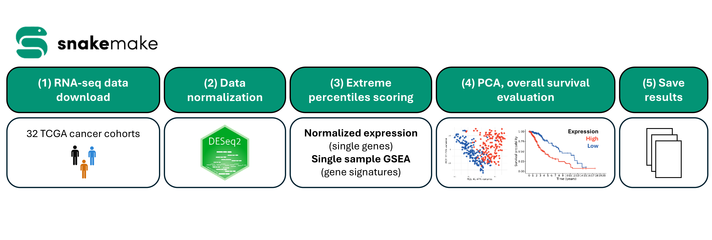

# Snakemake TCGA survival analysis

## Overview

This repository contains a Snakemake-based workflow for systematic and reproducible survival analyses one or multiple The Cancer Genome Atlas (TCGA) cohorts, based on patient (RNA-seq) expression of one or multiple gene or sets of genes defined by the user.

The workflow:

* Downloads TCGA RNA-seq and clinical data
* Normalizes gene-level expression
* Computes gene- and signature-level scores
* Stratifies patients using multiple percentile cutoffs
* Performs Kaplan–Meier survival analysis
* Generates survival statistics and summary outputs

The workflow is modular, scalable across TCGA projects, and fully reproducible through conda-managed environments.



## Repository structure

```
snakemake_tcga_stratification/
│
├── Snakefile
├── config.yaml
├── README.md
│
├── config/
│   ├── gene_signatures.txt
│   └── tcga_projects.txt
│   └── tcga_projects_all.txt
│
├── envs/
│   ├── merge_smk.yml
│   └── tcga_smk.yml
│
├── profiles/default/
│   └── config.yaml
│
└── workflow/
    ├── rules/
    │   ├── TCGA_download.smk
    │   ├── biomaRt_download.smk
    │   ├── DESeq2_normalization.smk
    │   ├── survival_screening.smk
    │   └── merge_survival_results.smk
    └── scripts/
        ├── TCGA_download.R
        ├── TCGA_split_SKCM.R
        ├── bioMart_download.R
        ├── DESeq2_normalization.R
        ├── compute_scores.R
        ├── survival_per_signature.R
        ├── merge_survival_results.R
        └── survival_screening.R
```
<br>

## Running time
The first run of the workflow will download the TCGA data from the Genomics Data Portal (GDC), which can be time consuming depending on your internet bandwidth.
<br>
<br>
After the first run, the workflow will not re-download the TCGA data unless the output directory on the config file is changed.
<br>
<br>
Once the data is available, **the workflow with the provided example gene list runs end-to-end in <5 minutes** in our high performance computing (HPC) cluster with a slurm scheduler, given that each step and cohort is processed in an independent job.

```
Our HPC specifications

7 standard compute nodes (HP Apollo 2000 Gen10+)
2 × AMD EPYC 7513 CPUs (32 cores, 2.8 GHz each)
256 GB RAM per node

1 high-memory compute node (HP Apollo 2000 Gen10+)
2 × AMD EPYC 7513 CPUs (32 cores, 2.8 GHz each)
1 TB RAM
```

## Worflow summary

The workflow performs the following steps:

**1) TCGA data download** (`TCGA_download.smk` → `TCGA_download.R`)

* RNA-seq counts and clinical metadata for each cohort are downloaded from the GDC, leveraging TCGAbiolinks.
* Skin cutaneous melanoma cohort (TCGA-SKCM) is split in primary and metastatic cases (`TCGA_split_SKCM.R`). (*)

**2) Gene annotation harmonization** (`biomaRt_download.smk` → `bioMart_download.R`)
* Ensembl gene IDs are converted to HGNC gene symbols using biomaRt.

**3) Expression Normalization** (`DESeq2_normalization.smk` → `DESeq2_normalization.R`)
* Raw STAR counts are imported into DESeq2.
* Median-of-ratios normalization is applied.
* Normalized expression values are saved in `.rds` for downstream analysis.
* The process is performed independently per cohort.

**4) Gene and/or gene signature scoring and survival screening** (`survival_screening.smk`)

This step is split into three rules that run in parallel per signature:

**4.1) Score computation** (`compute_scores.R`)

* Extreme percentiles of expression (configurable via `PERCENTILES` in `config.yaml`; default: 25%, 33%, 50%) are used to stratify patients.
* Single-gene signatures use DESeq2 normalized expression.
* Multi-gene signatures are scored using ssGSEA via the GSVA R package.
* For matched gene signatures (i.e. differentially upregulated and downregulated genes from in-house RNA-seq experiments) `_UP` / `_DOWN` signatures are combined.

```
Combined Score = UP − DOWN
```

* Outputs per cohort: `patient_scores.tsv`, `patient_scores_categorical.tsv`, `clinical_data.tsv`.

**4.2) Per-signature survival analysis** (`survival_per_signature.R`)

* Runs independently and in parallel for each signature, using the pre-computed scores.
* Patients are stratified into `High`, `Intermediate` and `Low` categorical groups.
* `Intermediate` samples excluded. `Low` and `High` groups retained and the following analyses are performed:
    * **Cox-Proportional Hazard**: including the information on the Kaplan-Meier curves.
    * **Survival analysis**: generating Kaplan–Meier curves. Saved as `.png`.
    * **Principal Component Analysis**: generating PCA plots, colored by group. Saved as `.png`.

**4.3) Result gathering** (inline Snakemake `run` block)

* Concatenates per-signature p-value tables into a single `survival_pval_filtered.tsv` per cohort.

**5) Result merging.**

* `.csv` summary files are saved with p-values per signature and cohort.

(*) TCGA-SKCM is the only cohort with sufficient number of cases to consider independently primary (n =~ 100) and metastatic (n =~ 370) cases separately.
The rest of the cohorts contain mainly primary specimens.

<br>

## Configuration and requirements

### Snakemake version

Clone the GitHub repository.

```
git clone https://github.com/cbib/snakemake_tcga_stratification
```

Install Snakemake in a conda environment.
The workflow was built under Snakemake v9.13.7. It may be needed to modify the workflow if your system does not support one of the newest versions, since file logic changes between Snakemake versions.

```
conda create --name snakemake

conda activate snakemake

conda install -c conda-forge -c bioconda snakemake
```

If you would like to run the workflow in a high performance computing (HPC) cluster with a scheduler, it is recommended to configure the cluster profile.

```
snakemake_tcga_stratification/
│
└── profiles/default/
    └── config.yaml
```

The `latency-wait` and `scheduler` parameters in the provided example are configured to prevent failures in the `TCGA_download.smk` step.

<br>

### Input files

You can/need to modify only three files to run this workflow.

**1) Configuration file.**
* The `DPI` refers to the density per pixel for the output.
* The `THRESHOLD` refers to the minimum p-value between groups for survival plots to be generated.
* The `PERCENTILES` is a list of expression percentile cutoffs used for patient stratification (e.g. `[25, 33, 50]`).
* The `pathvars` refer to results and log files storage.

```
snakemake_tcga_stratification/
└── config.yaml
```

**2) Gene signatures.**

* This is a tab-delimited file that will be used for the calculation of extreme expression profiles in each of the TCGA cohorts.
* Notice that if you have matched gene signatures (i.e. differentially upregulated and downregulated genes from in house RNA-seq experiments) you can use the same preffix and the suffixes `_UP` and `_DOWN`. The score for each signature will be calculated separately, and a combined score will be generated and stored separately.

```
Combined Score = UP − DOWN
```

* This signature combination allows the use of the complete information from differential expression profiles, rather than relying on differentially upregulated genes, as routinely performed in similar analyses.

```
snakemake_tcga_stratification/
└── config/
    └── gene_signatures.txt
```

**3) TCGA cohorts to be analyzed.**

* We recommend to test the workflow in a few cohorts before using it for a pan-cancer screening.

```
snakemake_tcga_stratification/
└── config/
    └── tcga_projects.txt
```

<br>

### Output files

For each TCGA project, the workflow generates the following folder structure:

```
/path_to_output/
├── biomart/
├── DESeq2_normalized/
├── GDCdata/
├── rds/
└── screening/
    ├── PCA/
    │   ├── TCGA-XXXX/
    │   │   └── PCA_<SIGNATURE>_<PERCENTILE>pct.png
    │   └── [...]
    └── survival/
        ├── TCGA-XXXX/
        │   ├── patient_scores.tsv
        │   ├── patient_scores_categorical.tsv
        │   ├── clinical_data.tsv
        │   ├── <SIGNATURE>_pval.tsv
        │   ├── survival_pval.tsv
        │   ├── survival_pval_filtered.tsv
        │   └── Survival_<SIGNATURE>_<PERCENTILE>pct.png
        ├── [...]
        ├── survival_pval_merged.xlsx
        ├── survival_pval_filtered_merged.xlsx
        └── merged_per_signature.xlsx
```

The folders contain the following files:
* **biomart/**
    * `.csv` file with ENSEMBL correspondence to HGNC gene symbols.
* **DESeq2_normalized/**
    * `.rds` DESeq2 objects with normalized counts for each cohort, including clinical metadata.
* **GDCdata/**
    * TCGAbiolinks output from `GDCdownload()` for each cohort. Deleted after export to reduce disk usage.
* **rds/**
    * `.rds` TCGAbiolinks objects with raw counts for each cohort, including clinical metadata.
* **screening/**
    * **PCA/**
        * A folder per TCGA cohort with PCA plots (`PCA_<SIGNATURE>_<PERCENTILE>pct.png`).
    * **survival/**
        * A folder per TCGA cohort containing:
            * `patient_scores.tsv` / `patient_scores_categorical.tsv` — continuous and discretized expression scores per patient and signature.
            * `clinical_data.tsv` — clinical metadata used for survival analysis.
            * `<SIGNATURE>_pval.tsv` — Cox PH statistics for that signature across all percentile cutoffs.
            * `survival_pval.tsv` / `survival_pval_filtered.tsv` — all and THRESHOLD-filtered p-values concatenated across signatures.
            * `Survival_<SIGNATURE>_<PERCENTILE>pct.png` — Kaplan–Meier curves.
        * Excel summary files (`survival_pval_merged.xlsx`, `survival_pval_filtered_merged.xlsx`, `merged_per_signature.xlsx`) across all cohorts in the parent directory.

### Running the workflow

Once the files have been modified, you can run the workflow by just running:

```
cd snakemake_tcga_stratification/

conda activate snakemake

snakemake
```

## Citation

If you use the workflow in your analyses, please, cite our original manuscript.

> Oterino-Sogo, S. & Naji, F. et al.
> *Spatial and bulk transcriptomic profiling defines the molecular
> evolution of cutaneous squamous cell carcinoma and reveals
> stage-specific biomarkers of clinical relevance.*
> bioRxiv (2026). https://doi.org/10.64898/2026.04.30.721943

<br>


## Contact and Support

The code in this repository was developed by Sergio Oterino Sogo.

LinkedIn: [Sergio Oterino Sogo, PhD](https://www.linkedin.com/in/sergio-oterino-sogo-phd-181962164/)

For reproducibility issues, please [open a GitHub issue](https://github.com/cbib/cSCC_continuum_analyses/issues).
